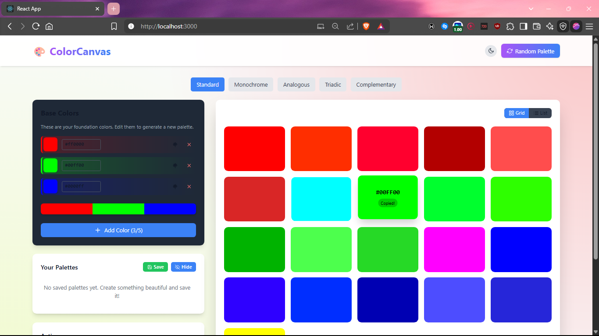
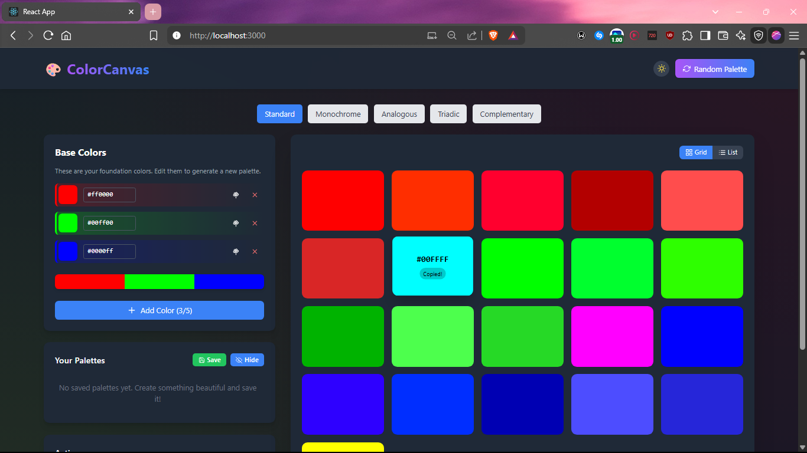

#  ColorCanvas

<div align="center">

<h3>
  <span style="background: linear-gradient(90deg, #FF5E5B, #D8D8D8, #39A0ED, #FCFF4B, #A479E8); -webkit-background-clip: text; color: transparent;">
    Where Colors Come to Life
  </span>
</h3>

[](https://reactjs.org/)
[](https://tailwindcss.com/)
[](https://opensource.org/licenses/MIT)

</div>

<div align="center">
  
</div>

---

## ✨ Express Your Creativity with ColorCanvas

ColorCanvas is an elegant color palette generator designed for creators, designers, and developers who understand that the perfect color scheme is the foundation of stunning visual experiences.

### What Makes ColorCanvas Special

- 🎭 **Dual Personality** - Seamlessly switch between light and dark themes
- 🖌️ **Precision Control** - Fine-tune each color to match your exact vision
- 💫 **Live Harmony Generation** - Watch complementary colors evolve in real-time
- 📋 **One-Click Copy** - Grab color codes instantly for your projects
- 📱 **Cross-Device Flow** - Create on any device without losing your artistic touch

---

<div align="center">
  
</div>

## 🎨 Create, Iterate, Perfect

ColorCanvas offers an intuitive interface where colors aren't just picked—they're crafted. Start with a single inspiration color and watch as ColorCanvas builds harmonious relationships that elevate your designs.

```
"Color is a power which directly influences the soul."
— Wassily Kandinsky
```

## 🚀 Begin Your Color Journey

### Prerequisites

- Node.js (v14+)
- npm or yarn

### Installation

```bash
# Clone the ColorCanvas repository
git clone https://github.com/madboy482/ColorCanvas.git

# Enter the artistic space
cd ColorCanvas

# Install the creative tools
npm install

# Start your color journey
npm start
```

Your canvas awaits at [http://localhost:3000](http://localhost:3000)

## 🧩 The Architecture of Art

```
ColorCanvas/
│
├── public/
│
├── src/                   # The creative source
│   ├── components/        # Building blocks of beauty
│   │   ├── ColorInput.jsx       # Your color voice
│   │   ├── ColorPickerModal.jsx # The selection experience
│   │   ├── ColorSwatch.jsx      # Individual color expression
│   │   └── PaletteDisplay.jsx   # The complete visual story
│   │
│   ├── utils/             # Creative assistants
│   │   └── colorUtils.js  # Color transformation magic
│   │
│   └── App.jsx            # The masterpiece orchestrator
│
└── tailwind.config.js     # The design system blueprint
```

## 💎 Crafted with Modern Elegance

ColorCanvas blends the best of modern web technologies to deliver a smooth, responsive experience:

- **React** – For a responsive and component-based interface
- **TailwindCSS** – Utility-first styling for pixel-perfect design
- **Color Science** – Advanced algorithms for perfect color relationships

## 🌈 On the Horizon

Our vision for ColorCanvas continues to evolve:

- **Palette Libraries** – Save and organize your color masterpieces
- **Export Formats** – Take your colors anywhere (SVG, PNG, CSS, SCSS)
- **Accessibility Vision** – Ensure your colors communicate to everyone
- **Community Gallery** – Share and discover palettes from creators worldwide
- **Color Psychology** – Learn how your colors affect viewers emotionally

## 🤝 Join the Collective

ColorCanvas thrives on creative collaboration. Share your ideas, improvements, and innovations:

1. Fork the canvas
2. Paint your changes (`git checkout -b feature/amazing-idea`)
3. Commit your vision (`git commit -m 'Add this amazing feature'`)
4. Share your work (`git push origin feature/amazing-idea`)
5. Open a Pull Request to join the gallery

## 📜 Creator's Rights

ColorCanvas is shared under the MIT License - express yourself freely.
See the [LICENSE](LICENSE) file for details.

---

<div align="center">
  <p>
    <strong>ColorCanvas</strong> – The digital space where colors find meaning.
  </p>
  <p style="font-size: 0.8em; color: #666;">
    © 2025 • madboy482
  </p>
</div>
